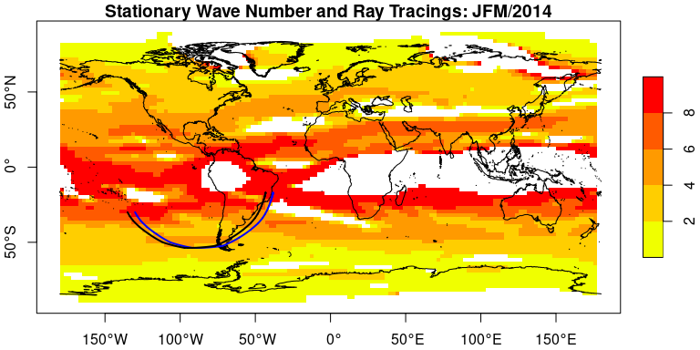

raytracing
================

[](https://travis-ci.com/github/salvatirehbein/raytracing)
[](https://codecov.io/gh/salvatirehbein/raytracing?branch=master)

## Raytracing Documentation

The identification of the atmospheric Rossby wave ray paths is of
paramount importance for atmospheric scientists, climatologists,
meteorologists, and students in order to research, assign, monitor and
forecast weather and climate patterns. `raytracing` is designed to
detect Rossby waves trigger regions, characteristics, and paths, using a
zonally symmetric basic state.

It relies on the theory described in:

  - [Hoskins and Karoly
    (1981)](https://journals.ametsoc.org/jas/article/38/6/1179/20507/The-Steady-Linear-Response-of-a-Spherical)
  - [Karoly
    (1983)](https://www.sciencedirect.com/science/article/abs/pii/0377026583900131)
  - [Hoskins and Ambrizzi
    (1993)](https://journals.ametsoc.org/jas/article/50/12/1661/23207/Rossby-Wave-Propagation-on-a-Realistic)
  - [Yang and Hoskins
    (1996)](https://journals.ametsoc.org/jas/article/53/16/2365/24038/Propagation-of-Rossby-Waves-of-Nonzero-Frequency)

For a brief review, see Rehbein et al. (2020).

## Including Code

The `raytracing` include the below functions:

| Functions   | Arguments                                                                            | Description                                               |
| :---------- | :----------------------------------------------------------------------------------- | :-------------------------------------------------------- |
| betaks      | u, lat, lon, uname, ofile, a, plots, show.warnings                                   | Calculates Beta and Ks                                    |
| ray         | betam, u, lat, x0, y0, K, dt, itime, direction, interpolation, tl, a, verbose, ofile | Calculates the Rossby waves ray paths                     |
| ray\_path   | x, y                                                                                 | Calculate the ray paths / great circles                   |
| ray\_source | betam, u, lat, x0, y0, K, dt, itime, direction, interpolation, tl, a, verbose, ofile | Calculate the Rossby waves ray paths over a source region |
| trin        | y, yk, mercator                                                                      | Performs trigonometric interpolation                      |
| ypos        | y, lat, yk, mercator                                                                 | Interpolation selecting the nearest neighbor              |

**Table** **1** **-** `raytracing` functions, arguments, and its
description.

## Instalation

To install the CRAN version:

``` r
install.packages("raytracing")
```

To install the developing version:

``` r
remotes::install_github("salvatirehbein/raytracing")
```

## Example

Simple usage example, reproduced from [Coelho et
al. (2015)](https://link.springer.com/article/10.1007/s00382-015-2800-1).

The `ray` or the `ray_source` functions return a `sf` `data.table` as
below:

``` r
head(rt)
```

    ## Simple feature collection with 6 features and 10 fields
    ## geometry type:  POINT
    ## dimension:      XY
    ## bbox:           xmin: -130 ymin: -49.98866 xmax: -106.6441 ymax: -30
    ## geographic CRS: WGS 84
    ##   K lat_ini lon_ini time iday       lat       lon lon_shift                  id
    ## 1 3     -30    -130    0    0 -30.00000 -130.0000  230.0000 K3_lati-30_loni-130
    ## 2 3     -30    -130    6    6 -32.47862 -128.5935  231.4065 K3_lati-30_loni-130
    ## 3 3     -30    -130   12   12 -35.64802 -126.2817  233.7183 K3_lati-30_loni-130
    ## 4 3     -30    -130   18   18 -39.65338 -122.2070  237.7930 K3_lati-30_loni-130
    ## 5 3     -30    -130   24    0 -44.48906 -115.7751  244.2249 K3_lati-30_loni-130
    ## 6 3     -30    -130   30    6 -49.98866 -106.6441  253.3559 K3_lati-30_loni-130
    ##   direction                    geometry
    ## 1        -1            POINT (-130 -30)
    ## 2        -1 POINT (-128.5935 -32.47862)
    ## 3        -1 POINT (-126.2817 -35.64802)
    ## 4        -1  POINT (-122.207 -39.65338)
    ## 5        -1 POINT (-115.7751 -44.48906)
    ## 6        -1 POINT (-106.6441 -49.98866)

``` r
tail(rt)
```

    ## Simple feature collection with 6 features and 10 fields (with 1 geometry empty)
    ## geometry type:  LINESTRING
    ## dimension:      XY
    ## bbox:           xmin: -43.27348 ymin: -17.45744 xmax: -43.17391 ymax: -16.92884
    ## geographic CRS: WGS 84
    ##     K lat_ini lon_ini time iday       lat       lon lon_shift
    ## 159 3     -30    -135  210   18 -17.45744 -43.27348  316.7265
    ## 160 3     -30    -135  216    0 -17.33805 -43.25002  316.7500
    ## 161 3     -30    -135  222    6 -17.22619 -43.22855  316.7714
    ## 162 3     -30    -135  228   12 -17.12113 -43.20884  316.7912
    ## 163 3     -30    -135  234   18 -17.02220 -43.19069  316.8093
    ## 164 3     -30    -135  240    0 -16.92884 -43.17391  316.8261
    ##                      id direction                       geometry
    ## 159 K3_lati-30_loni-135        -1 LINESTRING (-43.27348 -17.4...
    ## 160 K3_lati-30_loni-135        -1 LINESTRING (-43.25002 -17.3...
    ## 161 K3_lati-30_loni-135        -1 LINESTRING (-43.22855 -17.2...
    ## 162 K3_lati-30_loni-135        -1 LINESTRING (-43.20884 -17.1...
    ## 163 K3_lati-30_loni-135        -1 LINESTRING (-43.19069 -17.0...
    ## 164 K3_lati-30_loni-135        -1               LINESTRING EMPTY

``` r
# Large stationary wave numbers (Ks) or short wavelength are set to be Ks = 10
b$sfpoly$ksm <- ifelse(b$sfpoly$ksm > 10 & b$sfpoly$ksm <= 20, 10, 
                ifelse(b$sfpoly$ksm >=30 | b$sfpoly$ksm < 0, NA, 
                b$sfpoly$ksm))
# Plot Ks
plot(b$sfpoly["ksm"],
     lty = 0,
     axes = TRUE, 
     reset = FALSE,
     breaks = seq(0, 10, 2),
     pal= c("#f0ff00", "#ffce00", "#ff9a00", "#ff5a00", "#ff0000"),
     main = "Stationary Wave Number and Ray Tracings: JFM/2014")

# Plot contour maps
data(coastlines)
plot(coastlines, add = TRUE)
# Select linestrings for plotting only the lines
li <- rt[st_is(rt$geometry, "LINESTRING"), ]

# Plot ray traces
plot(li["lon_ini"],
    add = TRUE,
    lwd = 2,
    pal = colorRampPalette(c("black", "blue")))
```

<!-- --> This figure is a
reproduction of the Figure 9 from [Coelho et
al. (2015)](https://link.springer.com/article/10.1007/s00382-015-2800-1).

## citation

To cite raytracing in publications use this:

    Rehbein, A., Ambrizzi, T., Ibarra-Espinosa, S., Dutra, L. M. M.: Rossby Wave Ray Tracing v0.1.0. https://github.com/salvatirehbein/raytracing, 2020.

A BibTeX entry for LaTeX users is

    @Manual{ray,
        title = {raytracing: An R package for identification and tracking the atmospheric Rossby waves},
        author = {Amanda Rehbein and Tercio Ambrizzi and Sergio Ibarra-Espinosa and Livia M. M. Dutra},
        year = {2020},
        url = {https://github.com/salvatirehbein/raytracing},
      }

Thanks
