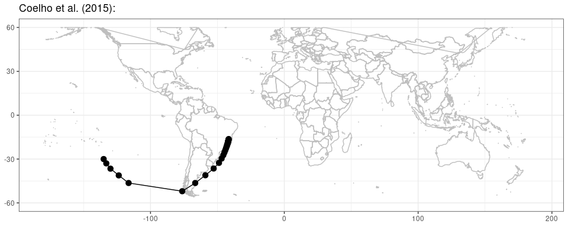

raytracing
================

## Raytracing Documentation

`raytracing` package uses Hoskins and Ambrizzi (1993) equations and a
similar methodology of Yang and Hoskins (1996). This document describes
how does the `raytracing` R package works with examples.

It is required an initial coordinate pairs that represents the source
for the Rossby wave.

## Including Code

The `raytracing` include 4 main functions inside the principal program,
`ray`:

| Functions | Arguments                                                        | Description                                                                                                                         |
| :-------- | :--------------------------------------------------------------- | :---------------------------------------------------------------------------------------------------------------------------------- |
| calcUg    | betamz, umz, y, lat, K, w, a                                     | Calculates the zonal group velocity                                                                                                 |
| calcVg    | betamz, umz, y, lat, K, direction, tl, a                         | Calculates the meridional group velocity                                                                                            |
| betaks    | ifile, varname, latname, lonname, ofile, a, plots, show.warnings | Calculates the stationary Rossby wave number, meridional gradient of the absolute vorticity, and zonal wind in mercator coordinates |
| ray       | betamz, umz, lat, x0, y0, K, dt, itime, direction, tl, a         | Calculates the Rossby wave ray paths                                                                                                |
| ypos      | y, lat                                                           | Obtain the closest position of a latitude in a vector                                                                               |

**Table** **1** **-** `raytracing` functions and arguments.

## Example

The Rossby wave ray paths obtained in Coelho et al. (2015) case with the
stationary Rossby wave number in background.

<!-- -->
