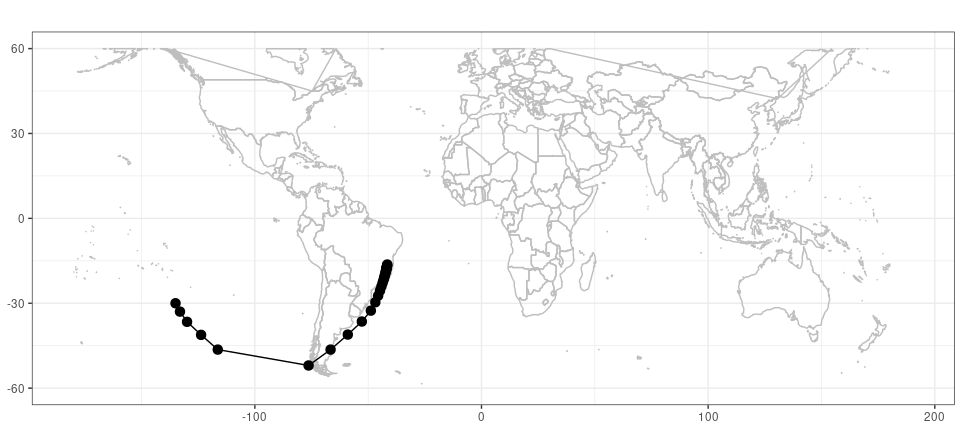

# Summary
Planetary or atmospheric Rossby waves have large influence on weather and climate around the world. Such influences can happen even far away from the wave sources, through wave patterns that connect the atmosphere in two different regions miles away from each other. An example of this comes from the El Niño Southern Oscillation (ENSO), in which the deep convection over the tropical Pacific ocean triggers disturbances in the atmosphere, leading to planetary waves that are able to travel towards the extratropics  and affect the climate and weather there. Latent heat sources, such as those linked to ENSO, are not the only source for Rossby waves triggering [@HoskinsKaroly1981; @AmbrizziHoskins1997]. Detecting the triggering regions of these waves, their characteristics, where they pass and where they go is of uppermost importance for research, assignment, monitoring and forecasting of weather and climate. Therefore, the detection and tracking of atmospheric Rossby waves is of paramount importance for scientists, climatologists, meteorologists and students seeking for a better understanding of the dynamics of the atmosphere.

The Group of Climate Studies (in Portuguese, GrEC; www.grec.iag.usp.br) is a research group from  the University of São Paulo (USP), Brazil, focused on analyzing the Earth's climatic variability and improving the state-of-the-art knowledge on this topic. In this sense, many research projects and activities developed within GrEC would benefit from the identification and tracking of atmospheric Rossby waves; recent examples include the work of  @Coelhoetal2015 and @Rehbeinetal2018, which investigated the mechanisms that contributed to the occurrence of extreme weather events over South America. The demand for an automated, free, user-friendly and open source model is constant, not only from within GrEC but also from other research groups. Therefore, we developed the R package raytracing to be used by any atmospheric dynamic researcher. The benefits of using R include its worldwide engaged community and its versatility to be installed on multiple operating systems [@R2020]. 


# Usage and theory

`raytracing` requires two basic parameters: the input data (a file containing zonal wind at the latitude/longitude grid in Network Common Data Form - NetCDF) and a first guess latitude and longitude coordinate pair.

All of this is organized in a single main function that coordinates the calculations according to predefined parameters. Other key functions also can be invoked as shown below. The data output format can also be defined by the users, which can be a database file (Comma-Separated Values, CSV) with values and calculation results for each possible new wave position (given the initial parameters) and/or an object stored in the memory of R in data.frame format. From there, the users will be able to carry out their desired analysis and generate figures according to their needs, being able to filter, for example, regions of arrival of wave rays.

These planetary waves can be approximated to the pure plane waves so that its group velocity or energy propagation ${\bf{c}}_g$, that is, the velocity in which a wave package propagates in the atmosphere, can be found as a function of the frequency, using the dispersion relation in  Eq. \ref{eq:omega}:

\begin{equation} \label{eq:omega}
\omega = \bar{U}_{M} k  - \frac{\beta_{M}  k}{k^{2} + l^{2}}
\end{equation}

Where $\bar{U}_{M}$ is the Mercator coordinate time-mean zonal wind, $k$ is the zonal wave number, $\beta_{M}$ is the Mercator coordinate analogous meridional gradient of absolute vorticity ($\beta_{*}$) times $cos (\phi)$, and $\phi$ is the latitude, and $l$ is the meridional wave number. Eq. \ref{eq:beta} shows $\beta_{*}$.

\begin{equation} \label{eq:beta}
\beta_{*} = \frac{d{f}}{d{y}}  - \frac{\partial^2\bar{U}}{\partial{y}^2}
\end{equation}

From Eq. \ref{eq:omega}, ${\bf{c}}_g$ is obtained as in Eq. \ref{eq:cg}:

\begin{equation} \label{eq:cg}
{\bf{c}}_g = (u_g, v_g) = \left(\frac{\partial\omega}{\partial{k}}, \frac{\partial\omega}{\partial{l}}\right)
\end{equation}

Where the zonal group velocity ($u_g$) and meridional group velocity ($v_g$) are, respectively, demonstrated in Eq. \ref{eq:ug} and \ref{eq:vg}.

\begin{equation} \label{eq:ug}
u_g = \frac{\omega}{k} - \frac{2 \beta_{M}  k^2}{{(k^{2} + l^{2})}^2}
\end{equation}

\begin{equation} \label{eq:vg}
v_g = \frac{2  \beta_{M}  k l}{{(k^{2} + l^{2})}^2}
\end{equation}

Just as in ray optics or geometric optics, @HoskinsKaroly1981 described that planetary waves follow a trajectory or ray perpendicular ahead of waves to any place in the direction of the local ${\bf{c}}_g$. In this way, the ray would be the path through which the energy would propagate at the same speed as ${\bf{c}}_g$. In order to find these rays or trajectories, we followed @YangHoskins1996, using a single-step numerical method to obtain the numerical solutions for Eqs. \ref{eq:dxdt} and \ref{eq:dydt}  given a time interval $\Delta{t}$. This facilitated the validation of the package, comparing the results obtained here with previous results [e.g. @MaganaAmbrizzi2005; @Coelhoetal2015, among others] that also used the methodology described in @YangHoskins1996.

\begin{equation} \label{eq:dxdt}
\mathrm{\frac{dx}{dt}} = u_g 
\end{equation}

\begin{equation} \label{eq:dydt}
\mathrm{\frac{dy}{dt}} = v_g 
\end{equation}

@HoskinsKaroly1981 also noticed that for the dispersion equation to be satisfied everywhere, $l$ must vary along the wave trajectory, because if there is not a dependence on $x$ and $t$, then $k$ and $\omega$ must not vary. From the total wavenumber $\mathrm{K}$, the zonal wave number $k$ is obtained: $k = \frac{\mathrm{K}}{a}$, where $a$ is the Earth's radius. 

The stationary Rossby waves was found largely to explain weather and climate patterns around the world [@HsuLin1992; @Ambrizzietal1995; @MaganaAmbrizzi2005; @Coelhoetal2015, among many others]. This happen for a constant  $k$ and $\omega = 0$, and a stationary wave number $\mathrm{K_s}$. $\mathrm{K_s}$ can be obtained in Mercator coordinates as in Eq. \ref{eq:ks} [@HoskinsKaroly1981] or considering the Earth’s sphericity as in Eq. \ref{eq:ksm} [@HoskinsAmbrizzi1993].


\begin{equation} \label{eq:ks}
\mathrm{K = K_s = \frac{\beta_{M}}{\bar{U}_M}}
\end{equation}

\begin{equation} \label{eq:ksm}
\mathrm{K_s = a\left(\frac{\beta_{M}cos\phi}{\bar{U}}\right)^{1/2}}
\end{equation}

# Exported functions

`raytracing` use mostly R base functions, importing only the library `ncdf4`.
The exported functions from `raytring` are:

|Function            |Description              | 
|--------------------|-------------------------|
|betaks| calculates $\beta_M$, $\mathrm{Ks}$, and $\bar{U}_M$|
|calcUg| resolves Eq. \ref{eq:dxdt}|
|calcVg| resolves Eq. \ref{eq:dydt}|
|ray| integrates `betaks`, `calcUg`, and, `calcVg` to obtain Rossby wave ray paths. It requires zonally symmetric basic state|
|ray_source| invokes `ray` for a set of possible Rossby wave sources configuration|
|ypos| simple function designed to get the vector position of a given latitude|


# Example of use raytraing

```r
input <- system.file("extdata",
                     "uwnd.mon.mean_200hPa_2014JFM.nc",
                      package = "raytracing")
b <- betaks(ifile = input)
a <- ray(betamz = colMeans(b$betam, na.rm = TRUE),
                umz = colMeans(b$um, na.rm = TRUE),
                lat = b$lat,
                K = 3,
                itime = 30,
                x0 = -135 + 360,
                y0 = -30,
                dt = 6 * 60 * 60,
                direction = -1)
```	
## A simple plot using R

```r
library(ggplot2)
ww <- map_data('world', ylim=c(-60,60))

ggplot() +  theme_bw() +
  scale_y_continuous(limits = c(-60,60)) +
  geom_polygon(data = ww,
               aes(x = long, y = lat, group = group),
               alpha = 0.0, col = "grey") +
  geom_point(data = a[!(a$tun_y0 == -1 |
                          a$tun_y1 == -1 | a$id == 0), ],
             aes(x = x0 - 360, y = y0), size = 3) +
  geom_line(data = a[!(a$tun_y0 == -1 |
                         a$tun_y1 == -1 | a$id == 0), ],
            aes(x = x0 - 360, y = y0)) +
  ggtitle("") +
  ylab(NULL) + xlab(NULL)
```



# Acknowledgements

We thank Dr. Gui-Ying Yang and Dr. Simone T. Ferraz for their useful comments. AR was supported by Fundação de Amparo à Pesquisa do Estado de São Paulo (FAPESP) Grant 2016/10557-0.

# References
